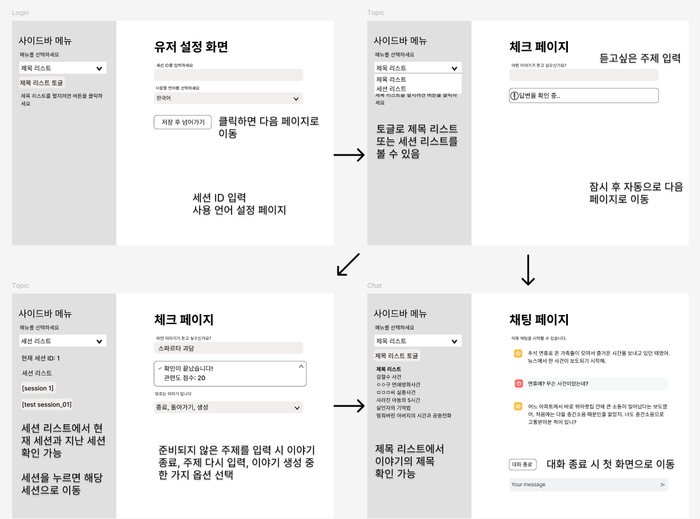

# 프로젝트 소개

이 프로젝트는 **사용자의 입력**을 기반으로 JSON 파일에 저장된 이야기 데이터를 활용하여 대화를 이끌어가는 **토크쇼 호스트** 같은 역할의 대화형 챗봇입니다.  
사용자에게 "어떤 이야기가 듣고 싶으신가요?"라는 질문을 던지고 챗봇이 해당 주제를 바탕으로 이야기를 진행하며 사용자와 상호작용 합니다.

---
## 팀 소개
**멤버**
- 공유라
    - 데이터셋 준비
    - 프론트앤드 개발
- 나영웅
    - 모델 로직 구현 
- 박수호
    - 모델 로직 구현
    - 데이터셋 준비
---
## 주요 기능

- **이야기 탐색 및 제공**:
  - 웹페이지 크롤링 데이터로 다양한 주제의 이야기를 제공
  - 사용자의 입력에 맞는 이야기를 검색하고 적합한 응답을 생성
  <details><summary>크롤링 사이트 선정</summary>

  | 항목          | 위키피디아                                            | 나무위키                                             |
  |---------------|-----------------------------------------------------|-----------------------------------------------------|
  | **크롤링 허용** | 허용 (API와 robots.txt를 통해 공식 지원)                | 제한적 (크롤링 금지 설정, API 없음)                      |
  | **라이선스**   | CC BY-SA 3.0 (상업적 사용 허용)                        | CC BY-NC-SA 2.0 (비상업적 사용만 허용)                  |
  | **상업적 활용** | 출처 표시 및 동일 조건 공유 시 가능                       | 불가능 (라이선스 위반)                                   |
  | **접근성**     | 오픈 데이터 (공익적 접근성)                              | 사용자 커뮤니티 중심, 제한적 접근성                         |
  
   접근성이 좋고 크롤링을 허용하는 위키피디아를 사용
  </details>

- **질문 유도**:
  - 챗봇이 사용자의 반응을 분석하여 적절한 질문과 응답을 생성
  <details><summary>gpt-4o vs gpt-4o-mini</summary>

  | 항목                  | **GPT-4.0**                            | **GPT-4.0 Mini**                     |
  |-----------------------|-----------------------------------------|---------------------------------------|
  | **모델 크기**          | 대형 모델 (매우 많은 매개변수)          | 경량 모델 (축소된 매개변수)            |
  | **성능**              | 최상위 성능, 높은 정확도                 | 적당한 성능, 빠른 추론 속도            |
  | **응답 속도**          | 상대적으로 느림                         | 더 빠름                                |
  | **리소스 요구 사항**    | 고사양 하드웨어 필요 (GPU 메모리 등)     | 저사양 환경에서도 동작 가능             |
  | **학습 데이터 크기**    | 방대한 데이터 사용                      | 상대적으로 작은 데이터 세트로 학습      |
  | **비용**              | 높은 비용 (클라우드 사용 시)             | 더 저렴한 비용                          |

  크롤링한 데이터의 크기가 크지 않기 때문에 응답속도와 비용을 고려하여 gpt-4o-mini 모델을 선택   
  최대 5초 이내 응답
  </details> 
- **이야기 생성 기능**:
  - 사용자가 제공한 URL이나 텍스트를 바탕으로 새로운 이야기를 생성 및 저장

- **대화 히스토리 관리**:
  - langchain을 사용하여 대화 맥락을 기억하고 유지하여 자연스러운 대화를 이어나감
  <details><summary>langchain의 특징</summary>

  장점
  - 대화 맥락 유지: 사용자의 대화를 기억하고, 자연스럽고 일관된 대화 흐름을 제공
  - 다양한 데이터 소스 통합: 외부 데이터베이스, API, 문서를 연동해 실시간으로 데이터를 활용 가능
  - 맞춤형 응답: 사용자 정보를 기반으로 개인화된 답변과 서비스를 제공
  - 복잡한 작업 처리: 멀티턴 대화와 조건 기반 논리를 처리하여 복잡한 요구사항도 해결
  - 확장성: 메모리 관리, 추론, 검색 등 모듈화된 설계를 통해 다양한 애플리케이션에 쉽게 적용 가능
  
  단점
  - 실시간으로 대량의 데이터를 처리하기 어려움
  - 대화가 길어질 경우 잘못된 대화 흐름으로 가거나 부정확한 응답 발생
  </details>
---


## 설치 및 실행방법

### 1. Python 버전
- Python 3.8.20 이상이 필요합니다.

### 2. 프로젝트 클론
프로젝트를 로컬 환경으로 복사합니다:
``` bash
git clone https://github.com/AI-8th-11m/11m-jira
```

### 3-1. 가상환경 생성 및 활성화 (macOS/Linux)
```
python -m venv venv
source venv/bin/activate
```

### 3-2. 가상환경 생성 및 활성화 (Windows)
```
python -m venv venv
venv\Scripts\activate
```

### 4. 필요 라이브러리 설치
```
pip install -r requirements.txt
```

### 5. 챗봇 실행
```
streamlit run app_mk2.py
```
streamlit 서버가 실행되면 브라우저에서 챗봇과 대화를 시작할 수 있습니다.

---

## 개발기간
- 2024.11.21(목)~2024.12.4(수)

---
## 기술스택
- **language**: Python 3.8.20
- **version control**: Github
- **IDE**: Visual Studio Code
- **Framework**: Streamlit(UI), Langchain(대화흐름 관리)
- **DBMS**: ChromaDB(벡터 데이터베이스)
---
## Key summary
- **이야기를 들려주는 챗봇**        
  - 단순 요약이 아닌, 이야기를 실제로 전달하는 것처럼 동작
  - 긴 이야기를 적절히 요약    
  - 없는 정보를 지어서는 안 됨        

- **사용자와 상호작용하는  챗봇**
  - 사용자의 반응을 이끌어냄     
  - 사용자의 반응에 적절하게 대응함    

---
## 서비스 구조
- **시나리오1**
1. 사용자가 특정 이야기를 요청
2. 데이터베이스(ChromaDB)에서 유사한 이야기를 검색
3. 검색한 이야기의 관련성 점수를 확인
    - 관련성 점수 80점 미만: 대화종료, 주제 다시 요청, 또는 새로운 이야기 생성 제안
    - 관련성 점수 80점이상 95점 미만: 사용자에게 더 구체적인 정보 요청
    - 관련성 점수 95점 이상: 해당 이야기 제공

- **시나리오2**
1. 사용자가 아무거나 또는 재미있는 이야기를 요청
2. 데이터베이스(ChromaDB)에 저장된 이야기 중 랜덤으로 선택

- **시나리오3**
1. 사용자가 새로운 이야기 또는 이야기 창조를 요청
2. 사용자에게 URL 또는 텍스트를 입력받아 관련된 이야기를 생성
3. 생성한 이야기는 chromaDB에 저장 

- **공통사항**
1. 스크립트 생성 및 이야기 진행
2. 사용자에게 질문 및 반응 유도
3. 대화 내용을 저장해 맥락 유지

---
## 주요 모듈 설명

| **모듈 이름**       | **설명**                                                                 |
|---------------------|-------------------------------------------------------------------------|
| `title_json_data`   | JSON 파일에서 `title`과 `content`를 추출하여 리스트로 반환.              |
| `load_vector_store` | ChromaDB를 초기화하고 데이터를 로드하여 검색 가능한 상태로 설정.         |
| `script_finder`     | 사용자 쿼리와 가장 관련이 높은 스크립트를 검색하고 점수를 반환.          |
| `chain_maker`       | 대화형 LangChain 체인을 생성하여 응답 생성.                              |
| `history_chain`     | 대화 히스토리를 저장하고 맥락 기반의 자연스러운 응답을 생성.            |
| `documents_filter`  | 데이터를 필터링하여 대화와 관련이 없는 정보를 제거.                     |
| `generate_script`   | 사용자가 입력한 텍스트나 URL을 바탕으로 새로운 스토리 생성.              |
| `script_maker`      | URL에서 크롤링한 데이터를 분석하고 이야기를 변환하여 데이터베이스에 저장. |

---
## API 명세서
| **Method** | **Endpoint**     | **Description**               | **Parameters**       | **Response**       |
|------------|------------------|-------------------------------|----------------------|--------------------|
| `POST`     | `/translate`     | 텍스트를 지정된 언어로 번역       | `text`, `lang`       | `translated_text`  |
| `GET`      | `/get-story`     | 특정 주제에 맞는 이야기 검색      | `query`              | `story`            |
| `POST`     | `/create-story`  | 새로운 이야기 생성              | `text` or `url`      | `created_story`    |

## 프로젝트 파일 구조
```
Project/
├── llm_chatbot/
│   ├── chatbot.py 
│   ├── docs_utills.py 
│   ├── script_utils.py 
│   ├── db_utils.py 
│   └── translator_module.py 
├── documents/
│   ├── filtered_unsolved_cases.json
│   └── korea_crime.json
├── db/
│   └── script_db/
│       ├── chroma.sqlite3
│       └── index/
├── app_mk2.py 
├── .gitignore
├── README.md
└── requirements.txt
```
---
## 와이어프레임

---

## 주요 트러블 슈팅

<details>
<summary>스크립트 생성 프롬프트</summary>

- 소설의 구성 방법 참고해 적용
- 불필요한 내용은 피해서 작성하도록 유도
- 과도하게 요약하여 내용이 빈약한 경우 방지 : 최소 3000토큰 지정
- 할루시네이션 방지

```python
persona = script writer
language = only in korean
least 3000 tokens
use input,
refer to sample,
write about time, character, event,
write only fact
ignore the mere listing of facts and write N/A

<sample>
# title : title of script
# prologue 1 : song, movie, book, show about subject
- content :
# prologue 2 : explain about subject
- content :
# prologue 3 : explain about character
- content :
# exposition 1 : historical background of subject
- content :
# exposition 2 : history of character
- content :
# exposition 3 : beginning of event
- content :
# development 1 : situation, action, static of character
- content :
# development 2 : influence of event
- content :
# development 3 : reaction of people
- content :
# climax 1 : event and effect bigger
- content :
# climax 2 : dramatic action, conflict
- content :
# climax 3 : falling Action
- content :
# denouement : resolution
- content :
# epilogue : message, remaining
- content :
</sample>

<input>
{summaries}
</input>Chatbot 프롬프트 고도화
```
</details>


<details>
<summary>챗봇 프롬프트</summary>

- 사용자의 답변에 맞춰 진행
- 스크립트에 적힌 헤더 등 기호 노출문제 수정
- 친근한 말투로 수정

```python
persona : story teller
    language : only korean
    tell dramatic story like talking to friend,
    speak informally,
    progress chapter by chapter,
    **hide header like '###'**,
    start chapter with interesting question,
    wait user answer
    give reaction to answer,
    do not use same reaction
    
    # script
    {script}

    #Previous Chat History:
    {chat_history}

    #Question: 
    {question} 
```
</details>
   

- 전체 트러블슈팅 목록 링크: [11m 트러블슈팅](https://www.notion.so/teamsparta/20efe511e121467cae1a910439eb163b?v=f61696500217417391270ff6ba0a517e)